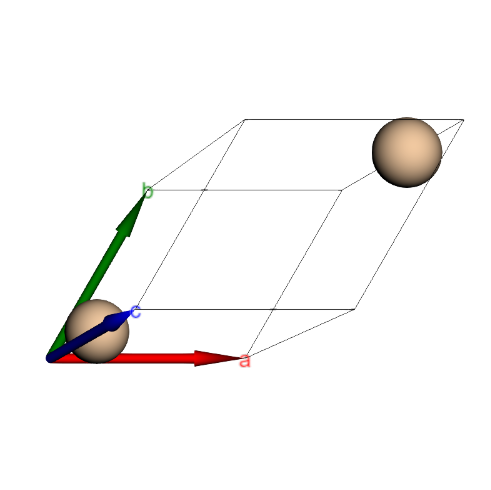
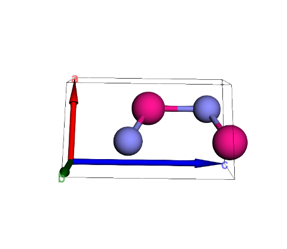

Using Python and the Materials Project API for Material Screening and Data Visualization.

★Project Overview

Leverage `pymatgen` to interface with the Materials Project database, automating the retrieval of thermodynamic stability, band structures, and space group information, followed by preliminary data screening.

★Development Environment
- Programming Language: Python 3.14
- Core Libraries: `mp-api`, `pymatgen`, `pandas`
- Visualization: `py3Dmol` (3D crystal simulation)

★Core Features
1. Single Material Visualization: Generate interactive 3D lattice models simply by inputting a Materials Project ID (MP-ID).
2. Batch Property Comparison: Retrieve material properties for multi-component systems (e.g., the Li-Fe-O system) in a single operation.
3. Stability Screening: Automatically calculate $E_{above\_hull}$ and identify stable phases.

★Experimental Results
The following table shows the top 5 materials in the Li-Fe-O system ranked by stability:

| Formula | Band Gap (eV)| Density (g/cm³) | Stability (E_hull) |
| :--- | :--- | :--- | :--- |
| LiFe5O8 | 0.00 | 4.29 | 0.000 |
| LiFeO2 | 2.10 | 4.35 | 0.000 |

★Crystal Visualization
The following are screenshots of interactive crystal models generated using `py3Dmol` . By utilizing HTML tables, we can effectively compare different structural systems side-by-side.

<table width="100%" cellspacing="0" cellpadding="5">
  <tr>
    <td align="center"><strong>Pure Aluminum(Al) - Face-Centered Cubic</strong></td>
    <td align="center"><strong>Gallium Nitride (GaN) - Wurtzite Structure</strong></td>
  </tr>
  <tr>
    <td align="center" valign="top">
      
    </td>
    <td align="center" valign="top">
      
    </td>
  </tr>
  <tr>
    <td align="center" valign="top">
      
<em>Materials Project ID: mp-134</em>

    </td>
    <td align="center" valign="top">
      
<em>Materials Project ID: mp-804</em>

    </td>
  </tr>
</table>

